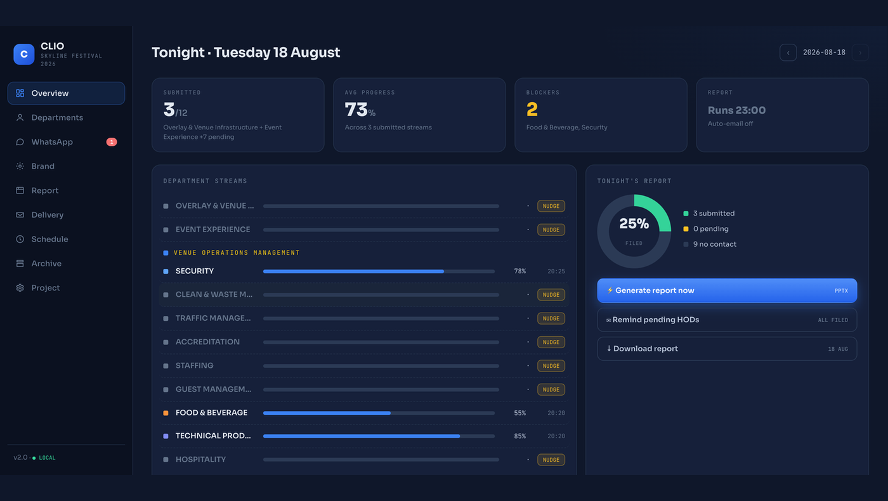
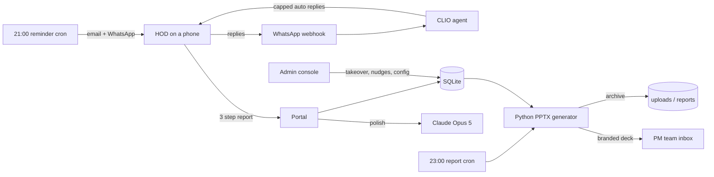
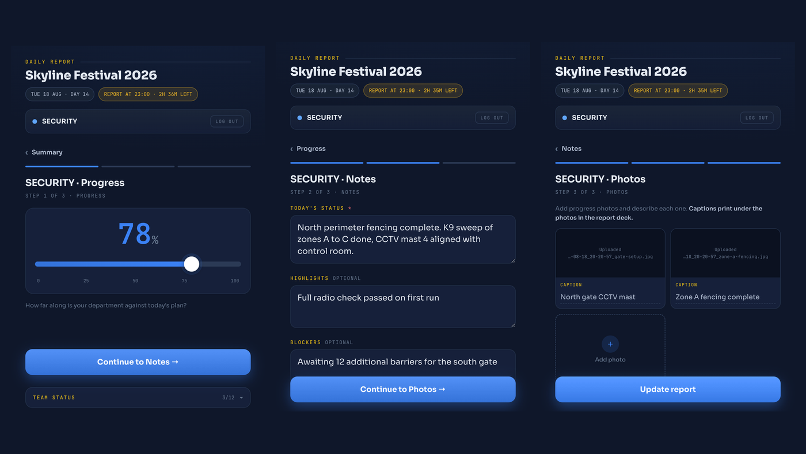
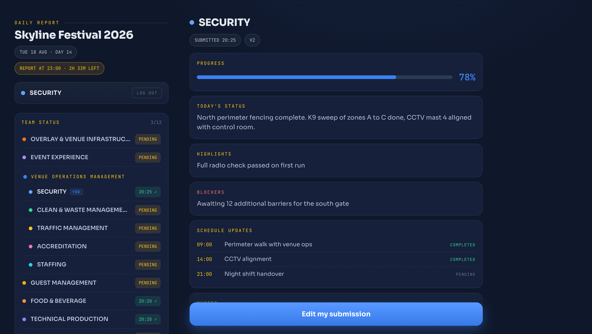
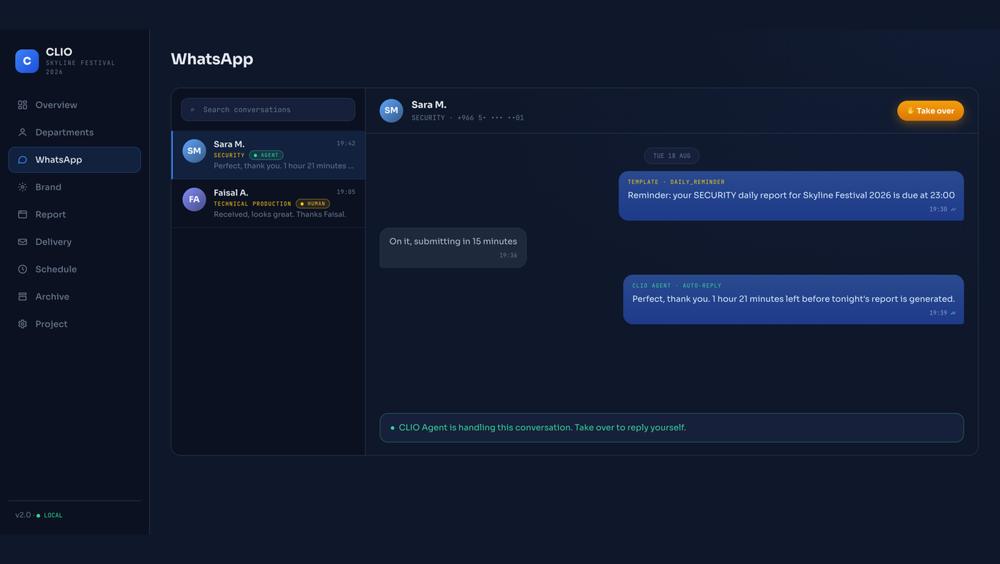
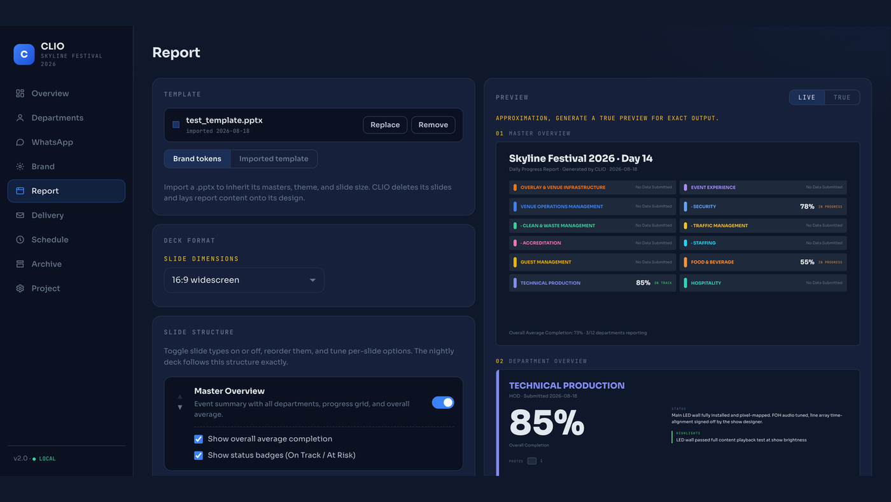
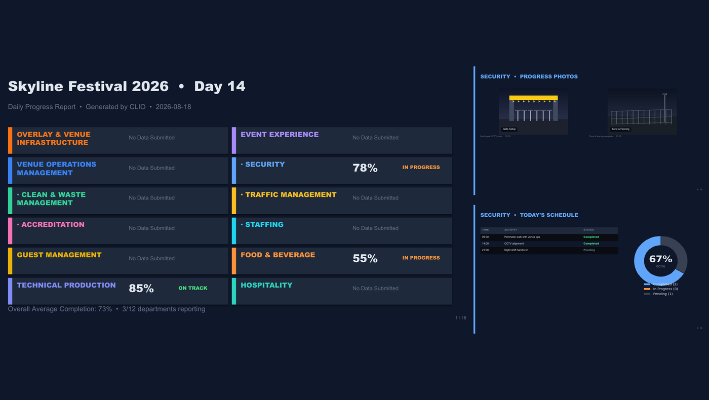
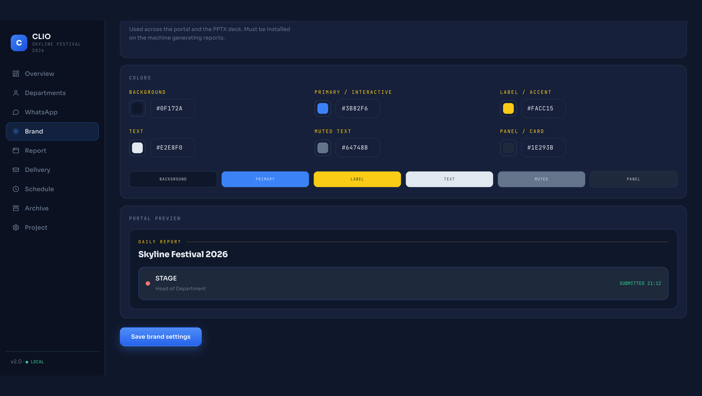

# CLIO

**The automated daily reporting agent for live event productions.**

Every department head files a guided report from their phone in under two minutes. CLIO polishes the text with AI, chases the stragglers by email and WhatsApp, answers their replies, and at 23:00 builds a branded PowerPoint from the day's data and emails it to the PM team. White label from the ground up: logo, colors, fonts, and company name are configured per deployment from the admin console.

<p align="center">
  
</p>

## How it works



One event day, end to end: submissions land all day, reminders go out at 21:00 to pending departments only, the deck builds and delivers at 23:00. Times, timezone, and recipients are all set from the console and apply live.

## The HOD experience

Personal logins generated by the admin in one click. Three guided steps: progress, notes, photos with captions. Drafts autosave locally so bad site wifi never loses a report. The same portal becomes a two pane workspace on a laptop.

<p align="center">
  
</p>

<p align="center">
  
</p>

## The admin console

Nine sections: Overview, Departments, WhatsApp, Brand, Report, Delivery, Schedule, Archive, Project. The overview is a control surface: who filed, average progress, blockers, per department nudges, and one click report generation. Every stream row opens into the full submission with photos.

## The WhatsApp agent

Reminders and receipts go out over the Meta Cloud API. HOD replies land in a threaded inbox where the CLIO agent answers with live context: submitted or not, deadline, portal link. Capped at 5 replies per conversation per day and 50 per day overall. Unknown numbers get a polite redirect and zero event information. Any conversation can be taken over by a human in one tap; the agent goes silent until handed back.

<p align="center">
  
</p>

## The nightly deck

The report builder imports your own PowerPoint template, lets you toggle and reorder slides, shows a live preview, and renders pixel true previews of the real deck before the night run. The output is a fully editable, on brand PPTX: overview, hierarchy grouped streams, per department pages, photo walls with captions, and schedules.

<p align="center">
  
</p>

<p align="center">
  
</p>

## White label

CLIO ships neutral. Logo, six brand colors, font, and company name are set once in the Brand section and flow through the portal, the console, the emails, and the deck.

<p align="center">
  
</p>

## Tech stack

| Layer | Technology |
|---|---|
| Backend | Node.js, Express, SQLite (better-sqlite3) |
| Frontend | Vanilla HTML/CSS/JS, no build step, mobile first |
| Reports | Python, python-pptx, matplotlib; LibreOffice + poppler for true previews |
| AI | Claude API (Opus 5 by default, switchable): text polish + WhatsApp agent |
| Messaging | Nodemailer (SMTP), Meta WhatsApp Cloud API with signed webhooks |
| Scheduling | node-cron, in process, configured from the console |
| Hosting | Railway (nixpacks), persistent volume via `DATA_DIR`, auto deploy from `main` |

## Quick start

```bash
cd clio-agent
./setup.sh            # npm install, pip3 install, db + directory setup
cp .env.example .env  # fill in ADMIN_PASSWORD, SMTP, optional WhatsApp
node server.js        # portal at http://localhost:3000, admin at /admin.html
npm test              # node:test suites
```

Full setup, configuration, WhatsApp onboarding, deployment, and troubleshooting live in **[clio-agent/README.md](clio-agent/README.md)**.

## Security highlights

- Per HOD accounts with salted scrypt hashes; passwords shown once; revocation kills live sessions instantly
- Submissions locked to the signed in department; uploads are authenticated before a byte is buffered
- WhatsApp webhooks verified with HMAC signatures and deduplicated against redeliveries
- Rate limited login and AI endpoints; append only audit trail of every action

## Documentation

- [System map and workflow](docs/workflow.html): every actor, endpoint, data store, and the ranked list of known gaps
- [Design reference](docs/design-preview.html): the approved visual system
- [Project instructions](CLAUDE.md): conventions and structure for AI assisted development

## License

White label product. © the deploying organization.
